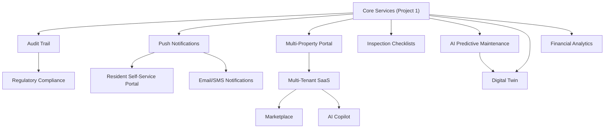

# Future Roadmap
## Raymond Gray IFM Platform

> **Parent:** [PROJECT-1-MASTER-PLAN.md](./PROJECT-1-MASTER-PLAN.md)  
> **Purpose:** Post-Project-1 feature ideas, expansion vision, and long-term strategic goals

---

## 1. Roadmap Categories

Features are organised into three horizons:

| Horizon | Description | When |
|---------|-------------|------|
| **H1: Foundation Enhancements** | Features that enhance Project 1 services directly | After core services are stable |
| **H2: Platform Expansion** | Major new capabilities and modules | After Project 1 is complete |
| **H3: Strategic Vision** | Transformative features for multi-tenant SaaS | After market validation |

---

## 2. H1: Foundation Enhancements

### 2.1 Audit Trail (Immutable Event Log)

**Problem:** No history of who changed what and when. Critical for compliance and dispute resolution.

**Solution:** An append-only `audit_log` table in a dedicated `audit` schema:

```sql
CREATE TABLE audit.event_log (
    id              BIGSERIAL PRIMARY KEY,
    event_type      VARCHAR(50) NOT NULL,    -- e.g., "work_order.status_changed"
    entity          VARCHAR(100) NOT NULL,
    entity_id       UUID NOT NULL,
    user_id         UUID NOT NULL,
    old_values      JSONB,
    new_values      JSONB,
    ip_address      INET,
    user_agent      TEXT,
    created_at      TIMESTAMPTZ DEFAULT NOW()
);

-- Immutable: no UPDATE or DELETE allowed
REVOKE UPDATE, DELETE ON audit.event_log FROM ALL;
```

Every service publishes audit events via Redis → a dedicated audit consumer writes them. This decouples audit logging from request latency.

**Affected services:** All  
**New infrastructure:** None (uses existing Neon + Redis)

---

### 2.2 Push Notifications (Mobile + Desktop)

**Problem:** Technicians and residents don't know about new work orders or request updates unless they check the app.

**Solution:**
- **Mobile:** Firebase Cloud Messaging (FCM) for both iOS and Android
- **Desktop:** OS-native notifications via Tauri's notification API
- **Web:** Browser Push Notifications API

**Integration point:** The Go API Gateway publishes a `notification.send` Redis event. A new lightweight **Notification Service** (Go or Python) subscribes and dispatches to FCM/APNs/Web Push.

**New component:** `rg-notification-service` (Go, ~500 lines)

---

### 2.3 Email & SMS Notifications

**Problem:** Residents without the app should still receive updates.

**Solution:**
- Email: SendGrid or AWS SES (transactional email)
- SMS: Twilio or AWS SNS

Triggered by the same Notification Service:
```
Redis event → Notification Service → {FCM, Email, SMS} based on user preference
```

User preferences stored in `auth_bridge.users`:
```sql
ALTER TABLE auth_bridge.users ADD COLUMN notification_prefs JSONB DEFAULT '{
    "email": true, "push": true, "sms": false
}';
```

---

### 2.4 Contract & Vendor Management

**Problem:** No system for tracking maintenance contracts, vendor SLAs, insurance policies, or warranty claims.

**Solution:** Extend the CMMS service (.NET) with:

```sql
-- cmms schema additions
CREATE TABLE vendor (
    id UUID PRIMARY KEY DEFAULT gen_random_uuid(),
    name VARCHAR(200) NOT NULL,
    type VARCHAR(50),            -- maintenance, cleaning, security, landscaping
    contact_name VARCHAR(100),
    contact_email VARCHAR(200),
    contact_phone VARCHAR(50),
    is_active BOOLEAN DEFAULT TRUE
);

CREATE TABLE contract (
    id UUID PRIMARY KEY DEFAULT gen_random_uuid(),
    vendor_id UUID REFERENCES vendor(id),
    property_id UUID,
    type VARCHAR(50),            -- maintenance, service, warranty
    start_date DATE,
    end_date DATE,
    auto_renew BOOLEAN DEFAULT FALSE,
    value NUMERIC(12,2),
    document_path TEXT,          -- MinIO path
    status VARCHAR(20) DEFAULT 'active'
);
```

**Alerts:** `.NET IHostedService` background job checks for contracts expiring within 30/60/90 days.

---

### 2.5 Inspection Checklists

**Problem:** Property inspections are paper-based or ad-hoc.

**Solution:** Mobile-driven inspection module in the Flutter app:

- Pre-defined checklist templates (fire safety, cleanliness, common areas)
- Photo capture per checklist item
- Automatic work order generation for failed items
- Historical compliance tracking

**Backend:** Extend Python Helpdesk service with inspection endpoints, or create a lightweight module in the Go service.

---

### 2.6 Advanced SLA Analytics

**Problem:** Dashboard shows current SLA status but no trends or predictions.

**Solution:** Extend the Ruby Report Engine with:
- SLA compliance trends over time (line charts)
- Predicted SLA breach probability based on current queue depth (simple linear regression)
- Response time distribution by category/priority (histogram)
- Technician performance rankings

---

## 3. H2: Platform Expansion

### 3.1 Multi-Property Portal

**Problem:** Managing multiple properties (buildings, communities) requires switching between isolated instances.

**Solution:**
- Add a `property` selector to the Next.js dashboard
- All API calls include `property_id` filter
- Facility managers can be assigned to multiple properties
- Cross-property reports (aggregate view across all managed properties)

**Implementation:** No architectural change — the schema already supports `property_id` on all entities. The frontend adds a property switcher component.

---

### 3.2 Resident Self-Service Portal

**Problem:** Residents need a dedicated app/portal for their specific needs.

**Solution:** A new Next.js app (or separate route group) tailored for residents:

- View and submit maintenance requests
- Track request status in real-time
- Book amenities with calendar UI
- View and pay billing (integrate Stripe or payment gateway)
- Complete satisfaction surveys
- View community notices and announcements

**Backend:** Reuses existing Helpdesk and CMMS APIs — no new services needed.

---

### 3.3 Financial Analytics Dashboard

**Problem:** No visibility into financial health of the property management operation.

**Solution:**
- Budget vs. actual tracking (planned maintenance cost vs. actual spend)
- Cash flow forecasting (based on billing history and seasonal patterns)
- Reserve fund projection (will the fund cover planned capital expenditures?)
- Revenue breakdown (HOA fees, special assessments, late fees)
- Delinquency tracking (overdue units, aging report)

**Integration:** Ruby Report Engine reads from `cmms.unit_billing` and generates financial reports.

---

### 3.4 Digital Twin (2D/3D Property Visualisation)

**Problem:** Hard to locate assets and understand spatial relationships.

**Solution:**
- Interactive 2D floor plans with clickable rooms/areas
- Overlay live sensor data (temperature, occupancy, power) on the floor plan
- Click an area to see assets, active work orders, recent PPM completions
- Technology: **Three.js** (3D) or **Leaflet/Mapbox GL** (2D) in the Next.js frontend

**Data flow:**
```
Floor plan images stored in MinIO
Sensor data from IoT Gateway via MQTT → Redis → WebSocket → Floor plan overlay
Asset positions from CMMS service (asset.location_floor, asset.location_room)
```

---

### 3.5 AI-Powered Predictive Maintenance

**Problem:** Reactive maintenance is expensive. Can we predict failures before they happen?

**Solution:** Python ML service using historical PPM and work order data:

- **Feature engineering:** asset age, failure frequency, PPM compliance rate, sensor readings
- **Model:** scikit-learn (Random Forest or Gradient Boosting) for failure probability prediction
- **Output:** "Asset XYZ has a 78% chance of failure within 30 days — recommend pre-emptive maintenance"
- **Integration:** Python service reads from `workorders` and `cmms` schemas, publishes predictions to a new Neon table, dashboard displays risk scores

**New component:** `rg-predictive-service` (Python, scikit-learn)

---

### 3.6 Knowledge Base & Documentation Management

**Problem:** Maintenance procedures, equipment manuals, and SOPs are scattered or lost.

**Solution:**
- Searchable knowledge base within the platform
- Link articles to assets, categories, and work order types
- When a technician opens a work order, suggest relevant articles
- Store documents in MinIO, index content for full-text search

**Implementation:** Either a new lightweight service or extend the existing Python Helpdesk with a `/kb` endpoint group + PostgreSQL full-text search (`tsvector`).

---

## 4. H3: Strategic Vision

### 4.1 Multi-Tenant SaaS

**Vision:** Offer the Raymond Gray IFM Platform as a SaaS product to other property management companies.

**Architecture changes:**
- Tenant isolation: schema-per-tenant in Neon (recommended) or row-level isolation
- Tenant onboarding: automated schema provisioning, seed data, admin user creation
- Custom branding: per-tenant logo, colours, domain (white-labeling)
- Billing: Stripe subscription per tenant (per-unit pricing)
- Tenant admin panel: self-service user management, billing, plan upgrades

See [SCALABILITY-PLAN.md](./SCALABILITY-PLAN.md) §8 for the multi-tenant isolation strategy.

---

### 4.2 Marketplace for Integrations

**Vision:** Allow third-party developers or internal teams to build integrations.

- **Webhook system:** Configurable outbound webhooks on any event (work order created, SLA breached, etc.)
- **REST API keys:** Per-tenant API keys with scoped permissions
- **Plugin system:** Lightweight plugin architecture for custom report templates, notification channels, and data importers

---

### 4.3 AI Copilot for Facility Managers

**Vision:** Natural language interface for facility management operations.

- "Show me all overdue work orders for Building A"
- "Create an emergency work order for the elevator in Tower 2"
- "What's the PPM compliance rate for HVAC assets this quarter?"
- "Generate the monthly report and email it to the board"

**Implementation:** LLM integration (Gemini/GPT API) with function calling → platform APIs. The AI translates natural language into API calls.

---

### 4.4 Energy Management & Sustainability

**Vision:** Track and optimise energy consumption across managed properties.

- Integrate with smart meters (via IoT Gateway)
- Track electricity, gas, water consumption per unit/floor/building
- Carbon footprint reporting
- Benchmark against industry standards (ENERGY STAR, LEED)
- Automated alerts for consumption anomalies

---

### 4.5 Regulatory Compliance Module

**Vision:** Automate compliance tracking for building codes, fire safety, and environmental regulations.

- Checklist templates per regulation (fire safety, ADA, local building codes)
- Automated scheduling of compliance inspections
- Document management for certificates, permits, and licenses
- Expiry alerts (fire extinguisher certification, elevator inspection)
- Compliance dashboard: % compliant across all regulations

---

## 5. Feature Prioritisation Framework

When deciding which features to build next, evaluate using this matrix:

| Criteria | Weight | Score 1-5 |
|----------|--------|-----------|
| User impact (how many users benefit) | 30% | |
| Revenue potential (direct or enabling) | 25% | |
| Implementation effort | 20% | |
| Strategic alignment (supports SaaS vision) | 15% | |
| Technical debt reduction | 10% | |

**Total Score = Σ (Weight × Score)**

Features scoring > 3.5 should be prioritised. Features scoring < 2.5 should be deferred.

---

## 6. Feature Dependency Map



Build features following the dependency arrows — foundational items first.
